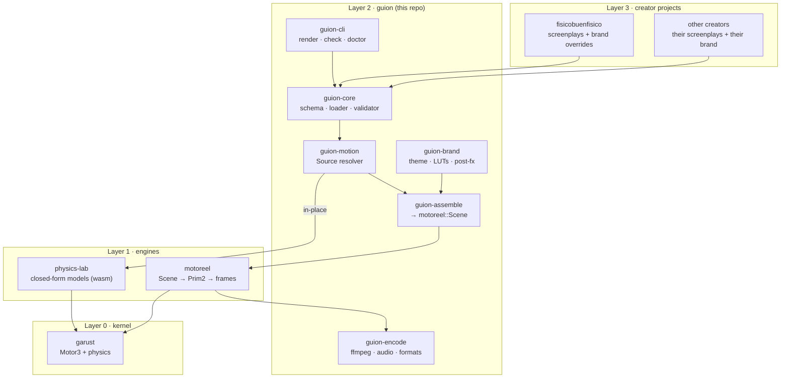
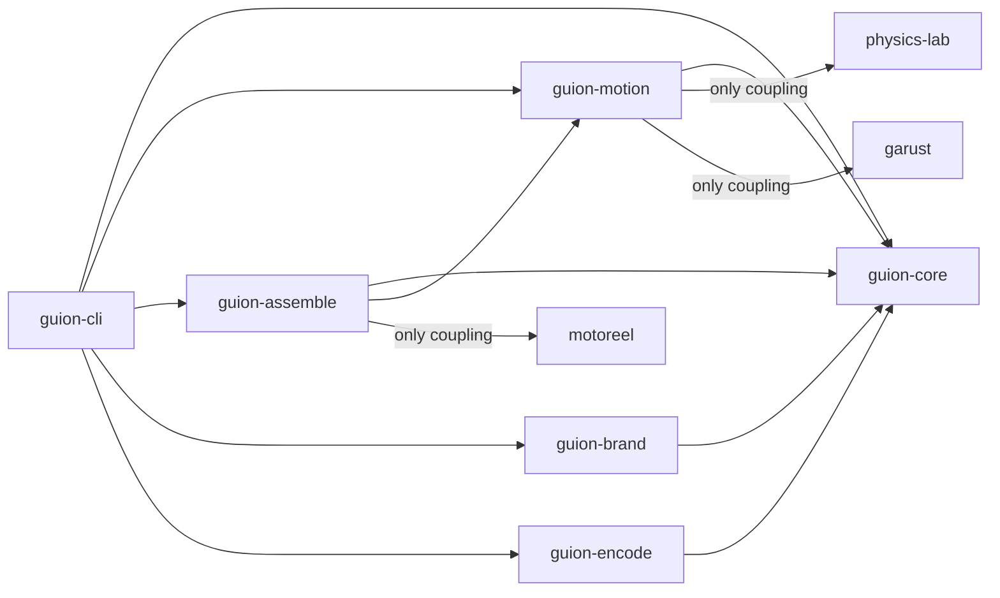
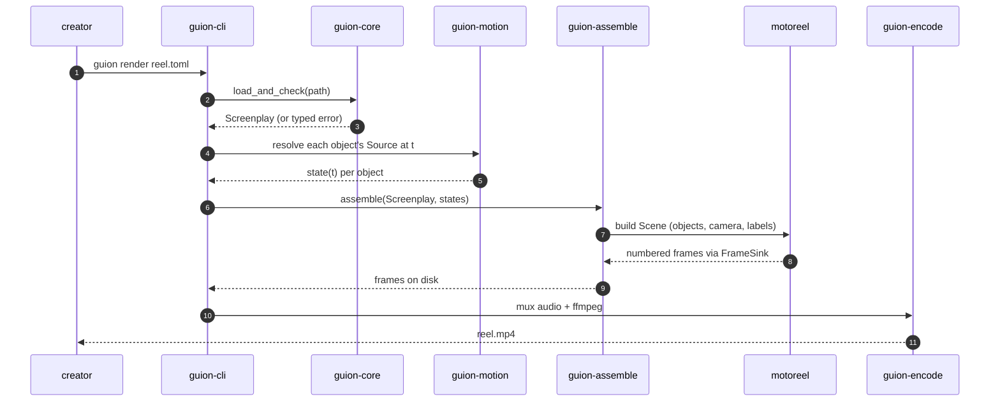
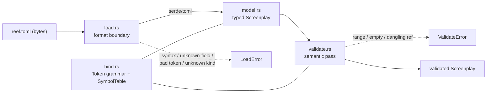

# Architecture

This document is the engineering-level companion to
[RFC-0001](RFC-0001-guion-framework.md). The RFC argues *why* `guion` should
exist and sketches the whole vision; this document pins down *how the system is
structured* — the layers, the crate boundaries, the contracts between them, the
data that flows through, and the invariants every layer must uphold.

It is written to be reviewable: each section states a decision and the reason
for it, and links to the requirement, spec, or ADR that owns the detail.

---

## 1. Scope & the one thesis

`guion` turns a **declarative screenplay** into a **finished vertical video**.
It is *not* a render engine and *not* a physics engine — those already exist
downstream. `guion` owns the creator-facing surface (schema, brand, delivery,
CLI) and the *seams* between the engines.

The whole framework rests on a single idea:

> **`Model` (what an object is) is independent of `Source` (how its state at
> time `t` is obtained).** A model is drawn the same way whether its state is
> computed in place from a closed form, integrated live from an initial
> condition, or played back from a precomputed rollout.

Everything below is in service of that separation. It is developed in full in
[RFC-0001 §3.2](RFC-0001-guion-framework.md#32-the-one-load-bearing-idea-model-what--source-how)
and captured as [ADR-0002](decisions/0002-motion-as-flat-timeline.md) at the
schema level.

---

## 2. The layered picture

`guion` is Layer 2 of a four-layer ecosystem. The dependency arrows only ever
point *downward* — a higher layer may depend on a lower one, never the reverse.

The ecosystem seam `guion` must never break is:

> *closed form when it exists; honest integration with measured bounds when it
> doesn't.* `motoreel` is the film studio (integrate offline); `physics-lab` is
> the classroom (closed form, no integrators in the browser).

`guion` adds a layer *above* both that can target either output — a rendered
film or an interactive lesson — from one screenplay, without violating that
seam. See [RFC-0001 §1.1](RFC-0001-guion-framework.md#11-the-four-repositories).

---

## 3. Crate map & ownership

`guion` is one Cargo workspace. Each crate is a single, well-defined
responsibility, and coupling to a downstream engine is confined to exactly one
crate so the rest of the framework never churns when an engine's API moves.

| Crate | Owns | Couples to | Status |
|-------|------|-----------|--------|
| **`guion-core`** | the screenplay schema, format boundary, validation, binding tokens | `serde`, `toml` only | **implemented** |
| `guion-motion` | resolving a `Source` (in-place / stepped / played) for a `Model` | `physics-lab`, `garust` | designed (M4) |
| `guion-assemble` | screenplay → `motoreel::Scene` + camera + labels | `motoreel` | designed (M1, [SPEC-0002](specs/0002-scene-assembly.md)) |
| `guion-brand` | theme, palettes, LUTs, fonts, halftone/grain, title marks | image libs | designed (M3) |
| `guion-encode` | audio, ffmpeg, muxing, vertical presets | ffmpeg | designed (M2) |
| `guion-cli` | `render` / `check` / `doctor`; wiring only | all guion crates | designed (M1, [SPEC-0003](specs/0003-cli-render.md)) |

**Rule of thumb** ([RFC-0001 §3.4](RFC-0001-guion-framework.md#34-what-lives-where-ownership-rules)):
if it is about *physics or pixels* it belongs downstream; if it is about
*authoring, brand, or delivery* it belongs in `guion`.

Two structural invariants make the map trustworthy:

- **Dependencies point inward.** `guion-core` depends on nothing but `serde`
  and `toml`; it never imports an engine. Everything else depends on
  `guion-core`. This is what lets the schema be the stable contract.
- **One seam, one owner.** `motoreel` types appear only in `guion-assemble`;
  `physics-lab`/`garust` only in `guion-motion`. When a downstream API changes,
  exactly one crate's tests break — `guion` is the ecosystem's *integration
  canary* ([RFC-0001 §7](RFC-0001-guion-framework.md#7-orchestrating-changes-across-the-sub-projects)).

---

## 4. The contracts (versioned seams)

`guion` pins and documents the interfaces it depends on. Each seam has exactly
one consuming crate and a compatibility note.

| Seam | Shape | Consumer |
|------|-------|----------|
| **motoreel** | `Scene` / `Object` / `Track` / `Ease` / `Camera` / `Prim2` / `FrameSink` + `record()` | `guion-assemble` |
| **physics-lab (closed form)** | flat-buffer C-ABI `params_ptr` → `state_at` → `prims_ptr` / `readouts_ptr`, driven through the model's compiled `.wasm` | `guion-motion` |
| **physics-lab (stepped)** | `init` / `step` / `state_ptr` (arrives with the sibling "simulated lesson" RFC) | `guion-motion` |
| **garust** | `Motor3` + `physics::{World, Body, Joint}` | `guion-motion` |

The **creator-facing contract** — the screenplay schema itself — is the seam
between Layer 3 and Layer 2, and it is the one this repo has actually built.
It is owned by `guion-core` and specified by
[R-0001](requirements/0001-screenplay-schema.md) /
[R-0006](requirements/0006-binding-tokens.md).

Calling closed-form models through their **`.wasm`** (not as native `rlib`s) is
a deliberate decision: the `.wasm` is the single artifact of truth that the
browser runs and CI verifies, so `guion` output cannot silently diverge from
the deployed lesson ([RFC-0001 §11 Q3](RFC-0001-guion-framework.md#11-open-questions--decisions-needed)).

---

## 5. Data flow: screenplay → frames → video

The full pipeline, and where each crate acts:

Two properties carry end-to-end:

- **Determinism.** Frame time is *derived* (`t = frame / fps`), never
  accumulated; loading and validation read only the given path — no env, no
  network. The same bytes always yield the same frames, a property the current
  Python pipeline does not guarantee ([R-0001 AC8](requirements/0001-screenplay-schema.md#3-acceptance-criteria)).
- **Total, typed failure.** No stage panics on bad input. A malformed
  screenplay stops at `guion-core` with a typed error naming the offending
  field; an unmappable scene stops at `guion-assemble` with a typed
  `AssembleError`. `render` writes no partial output on failure.

**What is built today** is the first two steps: `guion-core` turns bytes into a
validated `Screenplay` (or a precise error). The rest is designed and specced
but not yet code — see [ROADMAP.md](ROADMAP.md).

---

## 6. Inside `guion-core` (the built layer)

`guion-core` is the format boundary and the typed contract. Its internal shape:

The design splits every possible error into **two phases**:

1. **Load** (`load.rs` + `serde`/`toml`): structure, required fields, unknown
   fields, unknown enum `kind`s, and binding-token *grammar*. These surface as
   `LoadError`.
2. **Validate** (`validate.rs`): the meaning `serde` cannot check — numeric
   ranges, non-empty tags, and cross-reference *resolution*. These surface as
   `ValidateError`.

Why the split matters, the trade-offs it forced (notably `deny_unknown_fields`
vs. internal enum tagging), and a line-by-line traceability table to the tests
are in **[DESIGN-guion-core.md](DESIGN-guion-core.md)**. The binding-token
grammar and resolution rule have their own contract in
[R-0006](requirements/0006-binding-tokens.md).

---

## 7. Cross-cutting principles

These hold across every crate and are what the reviewer should hold the code
to:

1. **The screenplay is data, never code.** No expression language, no
   scripting, no inline physics. Physics is referenced by model id; motion is a
   declaration. This is the reusability thesis
   ([R-0001 §1](requirements/0001-screenplay-schema.md#1-statement)).
2. **Fail loudly, fail typed, fail located.** Every error names the field or
   token and where it occurred. A typo is never silently dropped
   ([ADR-0004](decisions/0004-deny-unknown-fields-and-kind-tagging.md)).
3. **Format is a boundary, not a fact.** The typed model knows nothing about
   TOML; adding RON/JSON is a new arm in `load.rs`, nothing else
   ([ADR-0001](decisions/0001-toml-format-boundary.md)).
4. **Standard-library-first dependencies.** `guion-core` uses only `serde` +
   `toml`; error types are hand-written (`Display`/`Error`), no `thiserror`.
   Dependencies point inward.
5. **Milestones are vertical slices.** Ship one real reel end-to-end before
   generalizing; M1 stops at frames on disk so the slice is provable without the
   delivery layer ([ROADMAP.md](ROADMAP.md)).

---

## 8. How the architecture evolves

`guion` is designed to absorb change from two directions:

- **Downstream engine churn** is absorbed at the single owning seam-crate; the
  schema and the CLI don't move. `guion doctor` (M5) will report whether each
  sibling engine is present and on a compatible pin.
- **Creator needs** flow *up* into new requirements. When a creator need can
  only be met downstream (e.g. `motoreel` needs a new anchor kind), `guion`
  originates the requirement, files it downstream, and integrates behind the
  seam ([RFC-0001 §7.2](RFC-0001-guion-framework.md#72-coordinated-change-workflow)).

The requirement/spec/ADR trail in `docs/` is not ceremony — it is how a
higher-level framework coordinates change across four repositories without any
one of them surprising another.
