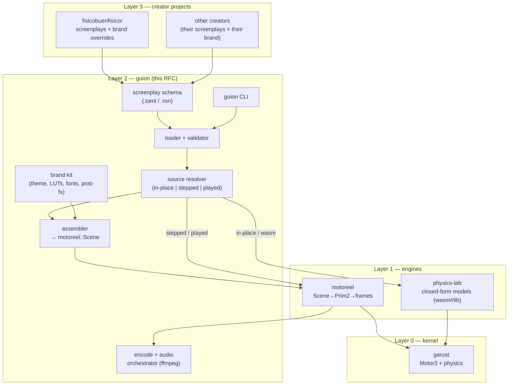

# RFC-0001 — `guion`: a creator framework for physics animation

**Status:** Discussing (proposal)
**Author:** físico buen físico
**Date:** 2026-08-28
**Supersedes:** the ad-hoc Python + PIL reel pipeline in `fisicobuenfisico/tools/`
**Depends on:** `garust` (GA kernel), `motoreel` (render engine), `physics-lab` (closed-form models)

---

## 0. TL;DR

Today, making a physics reel means writing a bespoke Python script that hand-codes
the physics, draws every frame with PIL, hand-rolls easing, sequences per-frame
parameters, applies brand styling, and shells out to ffmpeg. Every reel re-invents
the pipeline. Meanwhile `motoreel` already exists as a motor-native, Manim-style
render engine, and `physics-lab` already has verified closed-form physics — but
nothing connects them into something a creator (you, or anyone else) can pick up
and use without writing Rust internals.

This RFC proposes **`guion`**: a higher-level framework that sits on top of
`motoreel` and `physics-lab` (and, through them, `garust`) and lets a creator
describe a physics animation **declaratively** — a *screenplay* — and get a
finished, branded, vertical video out. `guion` owns the seams between the
sub-projects, orchestrates coordinated changes across them, and ships the
creator-facing surface (CLI, scene format, brand kit, templates) that none of the
lower layers should own.

> **Name.** *guión* (Spanish: "script / screenplay") — a creator writes the
> screenplay; the framework directs, films, and cuts it. Alternatives considered:
> `estudio`, `planos`, `reelab`, `tramoya`. Recommendation: **`guion`** (ASCII,
> fits the `garust`/`motoreel` naming register). Not load-bearing; easy to change.

---

## 1. Context: what exists today

### 1.1 The four repositories

| Repo | Layer | Language | Role | Public surface |
|------|-------|----------|------|----------------|
| `garust` | kernel | Rust | GA/PGA algebra + `physics` feature (rigid body) | `Motor3`, `physics::{World, Body, Joint}` |
| `motoreel` | engine | Rust | Manim-style, motor-native offline renderer | `Scene`, `Object`, `Track`, `Ease`, `Camera`, `record()`, `SvgSink`/`PpmSink` |
| `physics-lab` | classroom | Rust → WASM | closed-form interactive lessons | flat-buffer C-ABI: `params_ptr`/`state_at`/`prims_ptr`/`readouts_ptr` |
| `fisicobuenfisico` | content | Python + PIL | the actual reels that ship | none (scripts) |

Established ecosystem seam (from `physics-lab/docs/ARCHITECTURE.md`):

> *closed form when it exists; honest integration with measured bounds when it doesn't.*
> `motoreel` = the film studio (integrate offline). `physics-lab` = the classroom
> (closed form, no integrators in the browser). The seam is one-way:
> motoreel → physics-lab, as assets.

`guion` does **not** violate that seam. It adds a layer *above* both that can target
either output (a rendered film, or an interactive lesson) from one description.

### 1.2 How reels are actually made today (the honest audit)

Reading `tools/reel09.py` and its helpers (`fabrica.py`, `muneco.py`, `portadas.py`,
`reel02.py`, `reel05.py`) reveals a consistent, hand-rolled pipeline that is
**re-implemented per reel**:

| Concern | Current implementation | Where |
|---------|------------------------|-------|
| Physics | hand-coded formulas (`tau`, `fuerza_biceps`) | inline in each reel |
| Coordinate mapping | manual `P(mx,my)` model→pixel | inline, per reel |
| Motion / timeline | Python lists of per-frame param values | `seq = [...]` |
| Easing | hand-written smoothstep `ss(x)=x*x*(3-2x)` | copy-pasted |
| Drawing | direct PIL `ImageDraw` calls | inline |
| Reusable marks | `vector_calor`, `punteada`, `etiqueta`, `panelito`, `cap` | scattered across `muneco`/`reel02`/`reel05` |
| Plots | bespoke axis code (`gx`, `gy`, `grafica`) | inline, per reel |
| Brand style | halftone, grain, gradient, rotated titles, LUTs, fonts | `fabrica`, `portadas`, `brand/` |
| Layout | hard-coded 1080×1920, fixed pixel offsets | inline |
| Copy / pedagogy | Spanish hook + concept footer baked into frame | inline |
| Audio | `audio8.py` generates a track from frame count | shell-out |
| Encode | `ffmpeg` string with fixed flags | `os.system` |

**Diagnosis.** Everything `motoreel` was designed to provide — motor tracks, eased
`slerp`, a posed camera, primitives, frame sinks — is being re-derived in Python,
by hand, every time. The physics is trustworthy but unverified and non-reusable.
The brand system is real and valuable but entangled with per-reel drawing code.
There is no separation between *what the animation is* and *how it is drawn*.

This is precisely the "declarative scenes" gap that `motoreel`'s own roadmap files
under R-0008:

> *Describe a scene as data and render it without writing Rust — the physics-lab
> manifest pattern, applied to film.*

`guion` is the home for R-0008 and everything a creator needs around it.

---

## 2. Goals & non-goals

### 2.1 Goals

1. **Declarative authoring.** A creator writes a *screenplay* (a manifest) — objects,
   physics, motion, labels, brand, output format — and never touches Rust internals.
2. **Physics as a first-class motion source.** An object's state at time `t` can be
   obtained (a) *in place* from a closed-form model, (b) *integrated from 0* by a live
   stepper, or (c) *played over* a precomputed rollout. All three sit behind one
   `Model` × `Source` interface (§3.2) and draw through the same path.
3. **Reusable, verified physics.** Physics lives in `physics-lab` model crates with
   `cargo test` claims, not inline in a reel. A reel *references* a model.
4. **A themeable brand kit.** Port the `fisicobuenfisico` visual identity (palettes,
   LUTs, fonts, halftone, grain, title treatments) into a reusable, overridable theme
   so other creators can bring their own.
5. **One command to a finished video.** `guion render screenplay.toml` → branded,
   audio-mixed, vertical `.mp4`.
6. **Usable by other creators.** Templates, a scene schema, docs, and packaging so
   someone who is not you can produce on-brand-*for-them* physics content.
7. **Orchestrate the sub-projects.** `guion` owns the contracts between the repos and
   can propose/coordinate changes downstream (see §7).

### 2.2 Non-goals

- **Not** a new render engine. Rendering stays in `motoreel`. `guion` composes it.
- **Not** a new physics engine. Dynamics stay in `garust`; closed-form stays in
  `physics-lab`. `guion` selects and wires them.
- **Not** a real-time editor (at first). The first surface is file-in, video-out.
- **Not** a browser runtime. `physics-lab` already owns the interactive classroom.
- **Not** breaking the closed-form/integrate seam.

---

## 3. Proposed architecture

### 3.1 Layer diagram



### 3.2 The one load-bearing idea: `Model` (what) × `Source` (how)

The framework rests on separating two independent axes that every animated object has:

- **`Model` — *what* the object is:** a state type plus a rule for drawing that state.
- **`Source` — *how* its state at time `t` is obtained:** computed *in place*, *integrated
  from 0*, or *played over* a precomputed trajectory.

The `Model` never changes across the three modes; only the `Source` does. This is the
clean generalization of `motoreel`'s existing observation that keyframed and simulated
motion are the same currency — extended so it holds for closed-form physics, live
integration, and recorded rollouts alike.

#### The `Model` and its capabilities

```rust
// guion::model — WHAT an object is. Shared by all three sources.
pub trait Model {
    type State;
    fn draw(&self, s: &Self::State, p: &Params, out: &mut Prims, read: &mut Readouts);
    /// The conserved invariant used to *measure* integration error. `None` for
    /// closed-form models, which never approximate and owe no error band.
    fn energy(&self, _s: &Self::State) -> Option<f64> { None }
}

/// Capability A — state computable directly at any `t`. (velocity, projectile)
pub trait ClosedForm: Model {
    fn state_at(&self, p: &Params, t: f64) -> Self::State;
}

/// Capability B — an initial condition + a step. (double pendulum, n-body)
pub trait Integrable: Model {
    fn init(&self, p: &Params) -> Self::State;
    fn step(&self, s: &mut Self::State, p: &Params, dt: f64); // the integrator
}
```

A model implements whichever capabilities physics permits. Velocity is `ClosedForm`; a
double pendulum is `Integrable` only — it has **no** `state_at`, which is the correct
physical statement (no closed-form solution exists), enforced by the type system.

#### The `Source` — the three modes, one interface

```rust
// guion::source — HOW state at t is obtained. `Stepped` is the stateful stepper.
pub enum Source<M: Model> {
    /// (a) IN PLACE — pure, stateless recompute. Requires `M: ClosedForm`.
    InPlace,
    /// (b) INTEGRATED FROM 0 — holds live state + a cursor. Requires `M: Integrable`.
    Stepped { state: M::State, cursor: f64, dt: f64 },
    /// (c) PLAYED OVER — a precomputed trajectory, sampled/interpolated. Any model.
    Played { samples: Vec<(f64, M::State)> },
}

impl<M: Model> Source<M> {
    /// The one uniform question every consumer asks. The caller then `Model::draw`s
    /// the returned state and never learns which mode produced it.
    pub fn at(&mut self, m: &M, p: &Params, t: f64) -> &M::State {
        match self {
            Source::InPlace => /* &m.state_at(p, t) */ unimplemented!(),
            Source::Stepped { state, cursor, dt } => {
                while *cursor + *dt <= t { m.step(state, p, *dt); *cursor += *dt; }
                state
            }
            Source::Played { samples } => /* binary-search + interpolate */ unimplemented!(),
        }
    }
}
```

Every mode ends at a `State`, and `Model::draw` turns any `State` into `Prim2`s — so the
render loop, the browser runtime, and the test harness are all identical downstream.

#### Why this is the payoff, not just tidiness

1. **The modes are convertible; "played over" resolves the scrub/determinism tension.**
   Integrate (or evaluate) once from 0, bake the samples, then scrub freely and
   deterministically. This *is* `motoreel::record()`, generalized:

   ```rust
   pub fn bake<M: Integrable>(m: &M, p: &Params, dt: f64, steps: usize) -> Source<M> {
       let mut s = m.init(p);
       let mut samples = vec![(0.0, s)];
       for i in 1..=steps { m.step(&mut s, p, dt); samples.push((i as f64 * dt, s)); }
       Source::Played { samples }
   }
   ```

2. **Every consumer is just a `Source` choice over the *same* `Model`:**

   | Consumer | Capability | Source |
   |----------|------------|--------|
   | `physics-lab` closed-form lesson | `ClosedForm` | `InPlace` (today's `state_at`) |
   | `physics-lab` simulated lesson (new — see the sibling RFC) | `Integrable` | `Stepped` |
   | `motoreel` reel / scrubbable page | either | `Played` (baked once) |
   | `cargo test` claims | either | any — same code |

3. **A scene mixes modes freely.** A `Scene` is objects, each pairing a `Model` with a
   `Source`; object A `InPlace` (a closed-form graph), B `Stepped` (a live pendulum),
   C `Played` (a baked rollout) all compose because they share `Source::at`.

#### The two honesty rules this encodes

- **Capabilities gate legality.** `InPlace` requires `ClosedForm`; `Stepped` requires
  `Integrable`. You cannot ask a double pendulum for a closed form — the compiler says so.
- **Anything integrated must expose its error.** `Model::energy` lets a `Stepped` source
  (or a `Played` source baked from one) surface a measured energy-drift band — the
  "honest integration with measured bounds" rule. `InPlace` closed-form owes none.

#### Closed-form via wasm

A `ClosedForm` model backed by `physics-lab` loads the model's **`.wasm`** module (the
same artifact the browser runs and CI verifies — decided, §11 Q3) and drives its C-ABI
(`params_ptr` → `state_at` → read state from `readouts`/`prims`). One module is
instantiated once per model and reused across every frame, so wasm overhead is amortized
and never re-parsed per sample.

This is the load-bearing abstraction: **a creator picks a model and a mode; the renderer,
the lab, and the tests never know the difference.** It preserves the ecosystem seam
(closed-form when it exists, integrate when it doesn't) while hiding it behind one split.

### 3.3 Workspace / crate layout

`guion` is its own Cargo workspace that consumes the others as path/git deps:

```
guion/
├── Cargo.toml                      # workspace
├── crates/
│   ├── guion-core/                 # schema types, loader, validator, Model/Source specs
│   ├── guion-motion/               # Model/Source resolver: in-place | stepped | played
│   ├── guion-brand/                # theme, palettes, LUTs, fonts, post-fx (halftone/grain)
│   ├── guion-assemble/             # screenplay → motoreel::Scene + labels + camera
│   ├── guion-encode/               # frame → ffmpeg, audio mux, vertical formats
│   └── guion-cli/                  # `guion` binary (new, render, check, preview)
├── themes/
│   └── fbf/                        # físico buen físico theme (ported from brand/)
├── templates/                      # starter screenplays (lever, projectile, wave…)
├── schema/                         # JSON schema for editor autocompletion
└── docs/                           # RFCs, this proposal moves here
```

Dependency edges (all downstream, no cycles):

```
guion-cli → guion-{core,motion,brand,assemble,encode}
guion-assemble → motoreel
guion-motion   → motoreel (record), physics-lab (models), garust (physics)
guion-brand    → (image libs; optional motoreel post-fx hooks)
motoreel → garust
physics-lab → garust
```

### 3.4 What lives where (ownership rules)

| Concern | Owner | Rationale |
|---------|-------|-----------|
| GA algebra, rigid-body integration | `garust` | kernel |
| Scene → primitives → frames, tracks, easing, camera | `motoreel` | render engine |
| Verified closed-form physics + claims | `physics-lab` | classroom, tested |
| Declarative screenplay format & validation + `Model`/`Source` types | `guion-core` | creator-facing |
| Resolving a `Source` (in-place / stepped / played) for a `Model` | `guion-motion` | orchestration |
| Brand identity, LUTs, fonts, halftone, grain, titles | `guion-brand` | creator-facing |
| Layout, safe areas, vertical formats, captions | `guion-assemble` | creator-facing |
| Audio, ffmpeg, muxing, delivery | `guion-encode` | creator-facing |
| Cross-repo coordination & versioning | `guion` (meta) | see §7 |

**Rule of thumb:** if it is about *physics or pixels*, it belongs downstream
(`garust`/`motoreel`/`physics-lab`). If it is about *authoring, brand, or delivery*,
it belongs in `guion`.

---

## 4. The screenplay format (creator surface)

A screenplay is a single declarative file (recommend **TOML** for hand-editing;
**RON** if we want enums/expressions later). It mirrors the `physics-lab` "the whole
page as data" philosophy, applied to film. Illustrative example — the reel 09 lever
scene, expressed declaratively:

```toml
# biceps.screenplay.toml
[meta]
title   = "Levantas 20 kg, tu bíceps jala 160"
slug    = "reel-09-biceps"
format  = "vertical"          # 1080x1920
fps     = 30
theme    = "fbf"              # themes/fbf
lang     = "es"

[[model]]                      # references a physics-lab model, not inline math
id     = "lever"
source = "physics-lab:lever"   # resolves to the model's compiled .wasm + manifest
params = { load_mass = 20.0, forearm = 0.32, insertion = 0.04, upper_arm = 0.30 }

[camera]
kind  = "orthographic"
pose  = { translate = [0, 0, 6] }

[[object]]
id    = "forearm"
shape = { segment = { from = "@elbow", to = "@hand" } }   # bound to model outputs
style = { stroke = "skin", width = 34 }

[[object]]
id    = "biceps_force"
shape = { arrow = { at = "@insertion", value = "@biceps_force_N", scale = "auto" } }
style = { stroke = "heat:@biceps_force_N", width = 13 }

[[label]]
anchor = { pose = { object = "biceps_force", at = "mid" } }
text   = "bíceps {biceps_force_N:.0f} N"
style  = "callout"

[motion]                       # the timeline: drive the model's angle over time
drive = "@lever.phi"
from  = 0.0
to    = 2.53                   # 145°
ease  = "smootherstep"
hold  = { start = 1.0, end = 0.87 }   # dwell in/out, like the current seq[]

[hook]
text  = "¿POR QUÉ TANTO?"
at    = { start = 0.0, end = 2.05 }

[footer]
concept = "PALANCA DE TERCER GÉNERO — pierdes fuerza, ganas velocidad."
detail  = "Tu cuerpo cambió fuerza por rango y rapidez. El precio: 8× de tensión."
credit  = "mecánica fbf · reel 09 · @fisicobuenfisico"

[audio]
generator = "fbf-default"      # or a path to a wav
```

Key properties:

- **No physics in the screenplay.** `load_mass`, `forearm`, etc. are inputs to a
  *named, tested* model. `@biceps_force_N` is an output the model computes.
- **Motion is one declaration.** The `[motion]` block replaces the hand-built
  `seq = [...]` list; `ease`/`hold` reproduce the smoothstep dwell-in/dwell-out.
- **Brand is a reference**, not code. `theme = "fbf"` pulls palettes, fonts, LUTs,
  halftone/grain, and title treatments from `themes/fbf`.
- **Bindings** (`@elbow`, `@biceps_force_N`) connect geometry/labels to model outputs,
  the same idea as `physics-lab`'s readout slots and prim buffer.

---

## 5. The brand kit (`guion-brand`)

The `fisicobuenfisico` identity is real IP and the reason the reels look good. It must
survive the migration and become **themeable** so other creators can swap it.

Ported from the current workspace:

| Current asset | Becomes |
|---------------|---------|
| `brand/PALETTE.md`, `paletas.html` | `themes/fbf/palette.toml` (named colors + `heat()` ramp) |
| `brand/luts/`, `tools/make_luts.py`, `apply_look.py` | theme LUTs + a post-fx `look` step |
| `brand/fonts/` (bangers, mono) | theme font registry with roles (`title`, `mono`, `body`) |
| `fabrica.halftone/grain/gradient/rotated_text` | `guion-brand` post-fx passes + title renderer |
| `reel02.panelito`, `reel05.etiqueta/punteada`, `muneco.vector_calor` | themeable *mark* primitives (panel, callout, dashed, heat-vector) |

A theme is data + a small palette of reusable "marks." Marks are the vocabulary a
screenplay draws from (`arrow`, `panel`, `callout`, `dashed`, `plot`), each rendered
in the active theme's style. This is what makes reels consistent *and* lets another
creator define their own theme without touching engine code.

---

## 6. Rendering & delivery pipeline (`guion-encode`)

Reproduces (and generalizes) the current ffmpeg + audio flow:

```
screenplay.toml
  → guion-core: load + validate
  → guion-motion: resolve each object's Source (in-place | stepped | played) → state at t
  → guion-assemble: build motoreel::Scene (+ labels, camera, theme marks)
  → motoreel: Scene::render(fps, PpmSink) → numbered frames
  → guion-brand: post-fx pass (LUT / halftone / grain) if not done in-sink
  → guion-encode: audio (generated or provided) + ffmpeg → vertical .mp4
```

- **Formats** are named presets (`vertical` 1080×1920, `square`, `wide`) with safe-area
  metadata so captions/hooks never collide with platform UI.
- **Determinism** carries through from `motoreel` (numbered frames, derived `t`,
  never accumulated) so re-renders are reproducible — a property the current Python
  pipeline does not guarantee.
- **Preview mode** (`guion preview`) renders a low-fps proxy quickly for iteration.

---

## 7. Orchestrating changes across the sub-projects

"A higher-level framework that orchestrates changes for the others" means `guion`
owns the **contracts** between repos and can drive coordinated evolution. Two things:

### 7.1 Contracts (versioned seams)

`guion` pins and documents the interfaces it depends on:

- **motoreel seam:** the `Scene`/`Object`/`Track`/`Ease`/`Camera`/`Prim2`/`FrameSink`
  API and `record()` signature. `guion-assemble` is the *only* place that couples to it.
- **physics-lab seam:** the closed-form flat-buffer C-ABI (`params_ptr`/`state_at`/
  `prims_ptr`/`readouts_ptr`) for `InPlace`, and — once the sibling "simulated lesson"
  RFC lands — the stepped ABI (`init`/`step`/`state_ptr`) for `Stepped`, plus the
  manifest schema. `guion-motion` is the only consumer.
- **garust seam:** `Motor3` + `physics::{World, Body, Joint}`.

Each seam gets a compatibility note in `guion/docs/` and a version constraint in
`Cargo.toml`. When a downstream repo changes a seam, `guion`'s tests break first —
`guion` becomes the integration canary for the ecosystem.

### 7.2 Coordinated change workflow

Because all four repos share one RFC/requirement methodology (`CLAUDE.md` +
`requirements/` + `specs/`), `guion` can *originate* requirements that fan out:

1. A creator need surfaces in `guion` (e.g. "labels must anchor to model outputs").
2. `guion` writes the requirement and identifies which layer must change (e.g.
   `motoreel` needs a new anchor kind, or `physics-lab` needs a new readout).
3. `guion` files the downstream requirement (`motoreel` R-00NN) and tracks it.
4. Downstream ships behind the seam; `guion` bumps the pin and integrates.

Concretely, `guion` should provide a small `xtask`/meta command (e.g.
`guion doctor`) that checks all sibling repos are present, on compatible versions,
build green, and that the seams still match — the practical form of "orchestrates
changes for the others."

> **Decision needed (see §11):** monorepo (vendor all four under one workspace) vs
> polyrepo with path/git deps (current shape). Recommendation: **polyrepo**, keep
> each project independently testable and publishable, `guion` depends via path in
> dev and git tags in CI.

---

## 8. How other creators use it

The whole point is reusability beyond físico buen físico:

1. `guion new my-reel --template projectile` → scaffolds a screenplay + a brand stub.
2. Creator edits `screenplay.toml` (physics params, copy, motion) — no Rust.
3. Creator either reuses an existing `physics-lab` model or requests a new one (the
   only step that may need a contributor to write tested Rust).
4. Creator sets a theme (`fbf`, or their own under `themes/<name>/`).
5. `guion render screenplay.toml` → finished vertical video.

Distribution options: publish `guion-cli` on crates.io / as a prebuilt binary;
ship `physics-lab` models as a catalog the CLI can list (`guion models`).

---

## 9. Migration path from the current Python pipeline

Incremental, no big-bang rewrite:

| Phase | Action | Outcome |
|-------|--------|---------|
| P0 | Extract the physics of 1–2 reels (e.g. lever, projectile) into `physics-lab` model crates with `cargo test` claims | physics becomes verified + reusable |
| P1 | Build `guion-core` + `guion-assemble` + `guion-encode` MVP; render one reel from a screenplay to SVG/PPM → mp4 | proves the vertical slice end-to-end |
| P2 | Port the `fbf` brand kit (palette, LUTs, fonts, halftone/grain, marks) into `themes/fbf` | new reels match current look |
| P3 | Add `guion-motion` `Source` resolvers (`InPlace` wasm, `Stepped`, `Played`/bake); add templates + CLI `new`/`render`/`preview` | creator workflow complete |
| P4 | Re-cut existing reels as screenplays; retire per-reel Python | one pipeline, many reels |

The Python `tools/` stay as-is until each reel has a screenplay equivalent; nothing
breaks during migration.

---

## 10. Milestones (proposed)

- **M0 — Foundation.** Adopt ecosystem methodology in a new `guion` repo; write
  `project-specifics.md`; adopt this RFC; pin seams to `motoreel`/`physics-lab`/`garust`.
- **M1 — First screenplay.** `guion-core` schema + loader + validator; `guion-assemble`
  → `motoreel::Scene`; render a keyframe-only screenplay to frames. (motoreel R-0008 realized here.)
- **M2 — Delivery.** `guion-encode`: ffmpeg + audio + vertical presets; one full reel out.
- **M3 — Brand.** `guion-brand` + `themes/fbf`; on-brand output.
- **M4 — Physics motion.** `guion-motion`: the `Model` × `Source` split (§3.2) —
  `InPlace` (physics-lab wasm), `Stepped` (live integration), and `Played` (bake once,
  scrub freely, incl. `garust`/`record`).
- **M5 — Creators.** `guion new`, templates, `guion models`, `guion doctor`, docs.

---

## 11. Open questions / decisions needed

1. **Repo shape:** monorepo vs polyrepo (recommend polyrepo — §7.2).
2. **Screenplay format** *(open, leaning TOML)*: TOML (recommend, human-first) vs RON
   (Rust-enum-native) vs JSON (tooling-first). This is independent of the model-interop
   choice below. RON maps 1:1 to the `Source`/`Shape` enums, but the mandate is
   "creators without Rust," so TOML — with `kind = "..."` tags for the enum-shaped
   fields — keeps authoring approachable while a JSON schema drives editor
   autocompletion. RON stays the fallback if enum ergonomics in TOML prove painful.
3. **Closed-form model interop** *(decided: `.wasm`, 2026-08-28)*: `guion` calls
   `physics-lab` models via their compiled `.wasm` module rather than linking them as
   native `rlib`s. Rationale: the `.wasm` is the single artifact of truth — the exact
   module the browser runs and CI verifies — so `guion` output cannot silently diverge
   from the deployed lesson. The modest per-call overhead is amortized by instantiating
   each module once and reusing it across all frames.
4. **Where does post-fx run:** inside a `motoreel` sink, or as a `guion-brand` pass
   over emitted frames? Recommend a `guion-brand` pass to keep `motoreel` pure.
5. **Naming:** confirm `guion` vs alternatives (§0).
6. **Home for this doc:** stays in `fisicobuenfisico/docs/` for now; moves to
   `guion/docs/RFC-0001` once the repo is created.

---

## 12. Risks

| Risk | Mitigation |
|------|------------|
| Over-abstraction before a real reel ships | Vertical slice first (M1→M2), one real reel, then generalize |
| Brand quality regresses vs hand-tuned PIL | Port marks/post-fx 1:1; A/B against existing reels in P2 |
| Seam churn in fast-moving downstream repos | `guion` as integration canary + pinned versions + `guion doctor` |
| Creator format too rigid / too loose | Start from real reels; schema + templates; escape hatch to raw keyframes |
| A model has no closed form (e.g. double pendulum) | It implements `Integrable` only; drive it `Stepped` (live) or `Played` (baked) — the `Model`/`Source` split (§3.2) handles it by construction |

---

## 13. Recommendation

Adopt `guion` as a new, methodology-compliant repo that depends on `motoreel`,
`physics-lab`, and `garust` as crates. Build the M1→M2 vertical slice first
(one real reel, end to end, from a screenplay), then layer brand (M3), physics
motion (M4), and the creator toolkit (M5). This turns the current per-reel Python
craft into a reusable framework, gives `motoreel`'s backlogged R-0008 a home, and
makes físico buen físico's pipeline something other creators can adopt.
