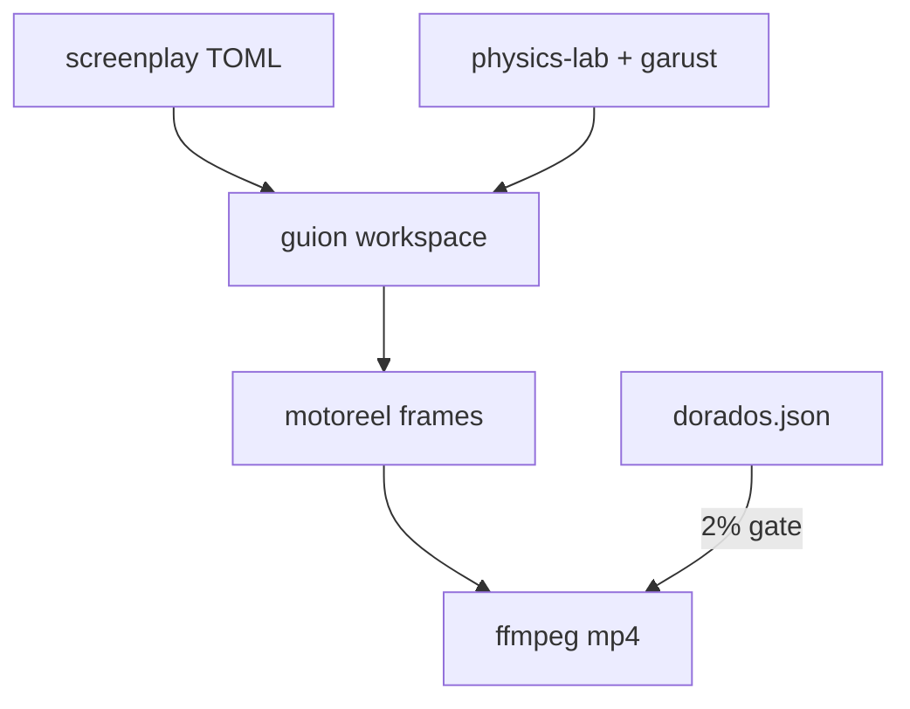

# Arquitectura — guion-video-creator

## Propósito

Mandate for declarative screenplay → frame → mp4; golden fixtures must match published reels within 2%.

## Mapa de módulos

```
guion-video-creator/
├── docs/ENCARGO.md, FISICA.md, VERIFICACION.md
└── fixtures/dorados.json  # 135 golden samples
```

## Diagrama de componentes



## Capas y responsabilidades

Ver [code-walkthrough.md](./code-walkthrough.md) para el recorrido módulo a módulo.

## Documentación adicional

- `docs/ENCARGO.md`
- `docs/FISICA.md`
- `docs/VERIFICACION.md`
