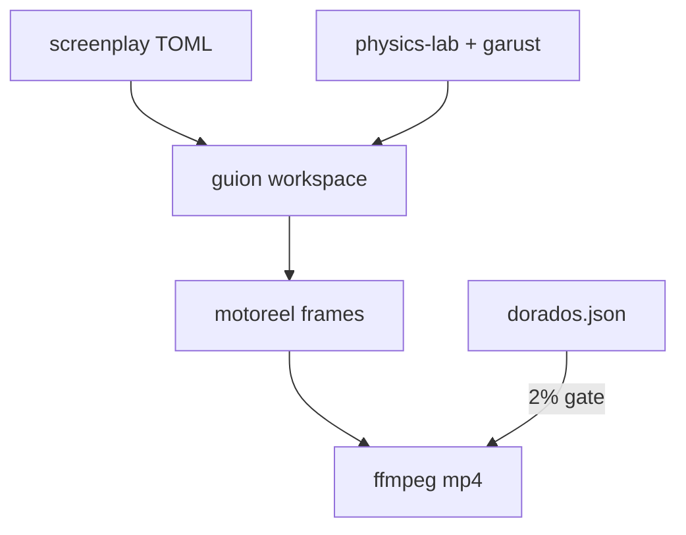
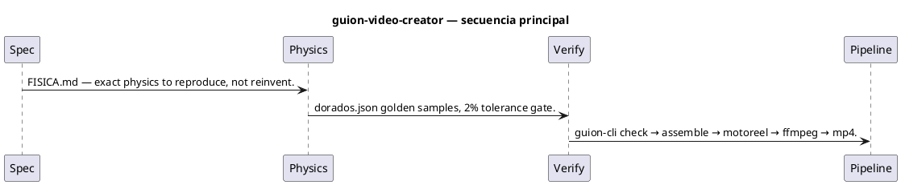
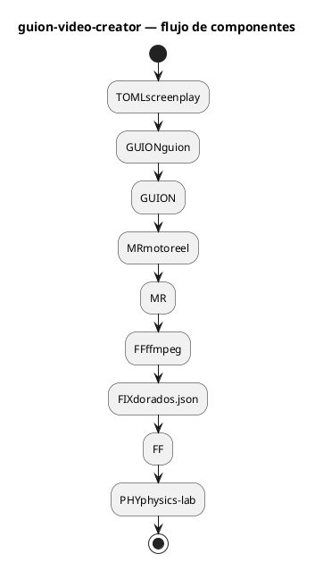

# Flujos — guion-video-creator

## Flujo principal (Mermaid)

## Descripción paso a paso

1. **Spec** — ENCARGO.md defines mandate, decisions, acceptance criteria.
2. **Physics** — FISICA.md — exact physics to reproduce, not reinvent.
3. **Verify** — dorados.json golden samples, 2% tolerance gate.
4. **Pipeline** — guion-cli check → assemble → motoreel → ffmpeg → mp4.

## Secuencia (PlantUML)

Fuente: [`diagrams/flow-sequence.puml`](./diagrams/flow-sequence.puml)

## Componentes / estados (PlantUML)

Fuente: [`diagrams/flow-architecture.puml`](./diagrams/flow-architecture.puml)

## Estados y casos borde

Consulta los tests de integración y los RFC/requirements del proyecto para flujos de error y recuperación.
