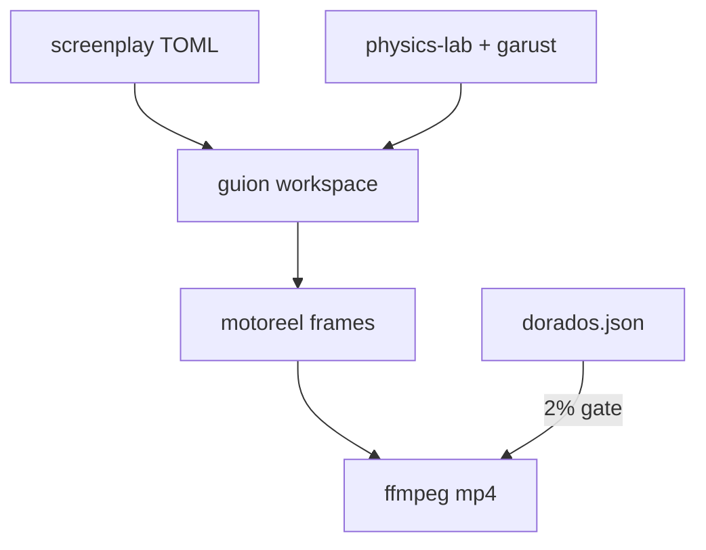
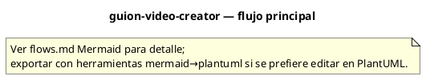

# Flujos — guion-video-creator

## Flujo principal

## Descripción paso a paso

1. **Spec** — ENCARGO.md defines mandate, decisions, acceptance criteria.
1. **Physics** — FISICA.md — exact physics to reproduce, not reinvent.
1. **Verify** — dorados.json golden samples, 2% tolerance gate.
1. **Pipeline** — guion-cli check → assemble → motoreel → ffmpeg → mp4.

## Diagrama PlantUML

Equivalente PlantUML del flujo principal (misma topología que el diagrama Mermaid):

## Estados y casos borde

Consulta los tests de integración y los RFC/requirements del proyecto para flujos de error y recuperación.
